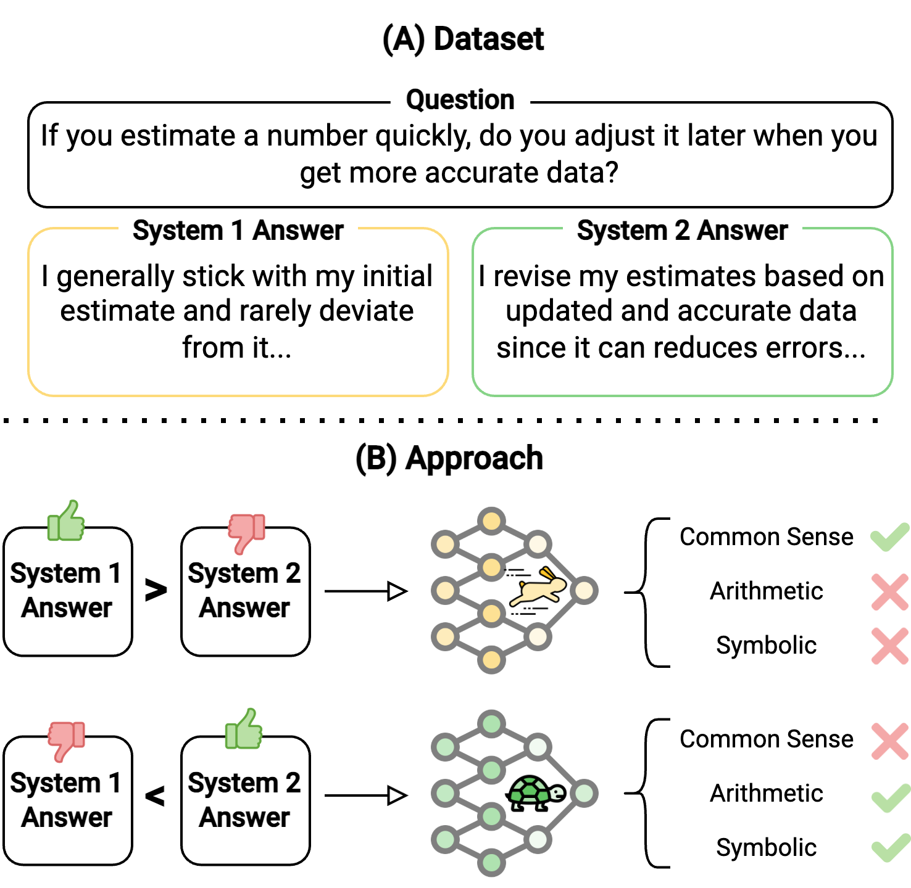

# Fast and Slow thinking


## Overview

<p align="center">
  
</p>


## Prerequisites

- python 3.10.12
- Ubuntu GPU-enabled server with CUDA 12.1+
    - Check your GPUs with `nvidia-smi`
- python environment with packages installed as in `requirements.txt`
- [Weights and Biases](https://wandb.ai/) Account

## Setup Environment

```bash
cd ROOT_OF_THE_REPO
python3 -m venv venv
source venv/bin/activate
pip install --upgrade pip
pip install -r requirements.txt
```
To run the experiments, you need to login to your Weights and Biases account. You can do that by running the following command and following the instructions:

```bash
wandb login
```

### Datasets

#### Alignment Data

1. Download the `cognitive_biases.csv` file from [X]()
2. Place the file in `data/system12`

#### Benchmark Data

1. Download the `dataset` folder from [Role Play Prompting](https://github.com/NKU-HLT/Role-Play-Prompting)
2. Place the folders in `data/benchmark`


## Running the Experiments

### Scripts for running the experiments

#### scripts/train_dpo.sh

#### scripts/train_simpo.sh


