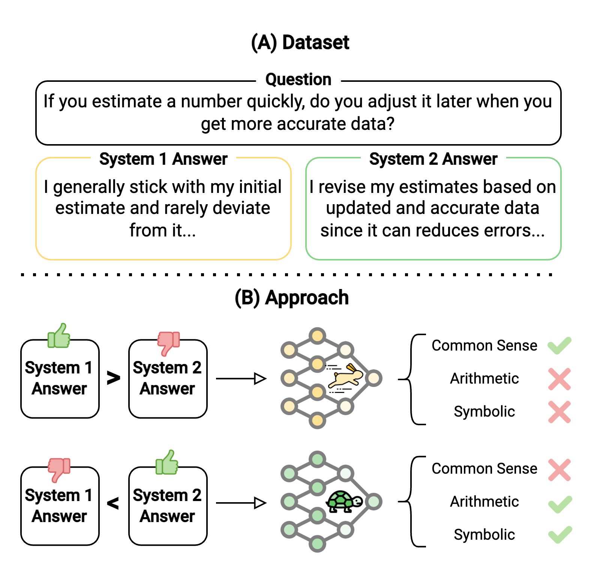

# Fast and Slow thinking


## Overview

<p align="center">
  
</p>


## Prerequisites

- python 3.10.12
- Ubuntu GPU-enabled server with CUDA 12.1+
    - Check your GPUs with `nvidia-smi`
- python environment with packages installed as in `requirements.txt`
- [Weights and Biases](https://wandb.ai/) Account

## Setup Environment

```bash
cd ROOT_OF_THE_REPO
python3 -m venv venv
source venv/bin/activate
pip install --upgrade pip
pip install -r requirements.txt
```
To run the experiments, you need to login to your Weights and Biases account. You can do that by running the following command and following the instructions:

```bash
wandb login
```

### Datasets

#### Alignment Data

1. Download the `cognitive_biases.csv` file from [X]()
2. Place the file in `data/system12`

#### Benchmark Data

1. Download the `dataset` folder from [Role Play Prompting](https://github.com/NKU-HLT/Role-Play-Prompting)
2. Place the folders in `data/benchmark`

## Running the Experiments

### Experiment 1

#### scripts/train_dpo.sh
The shell script will run the `train_dpo.py` to align our base models, Llama 3 and Mistral v0.1, with System 1 and System 2 data using the DPO algorithm.

#### scripts/train_simpo.sh
The shell script will run the `train_simpo.py` to align our base models, Llama 3 and Mistral v0.1, with System 1 and System 2 data using the SIMPO algorithm.

#### scripts/benchmark_llama.sh
The shell script will run the `benchmark_llama.py` to evaluate our Llama 3 aligned model on reasoning benchmarks.

#### scripts/benchmark_mistral.sh
The shell script will run the `benchmark_llama.py` to evaluate our Mistral v0.1 aligned model on reasoning benchmarks.

#### scripts/benchmark_cot.sh
The shell script will run the `benchmark_cot.py` to evaluate our base models, Llama 3 and Mistral v0.1 with zero-shot CoT.

### Experiment 2
#### src/notebooks/response_analysis.ipynb
The notebook uses `src/notebooks/data/benchmark results - dpo dif.csv` and `src/notebooks/data/benchmark results - simpo dif.csv` to generate a plot showing the word differences in stages one and two relative to LLaMA 3 for the DPO and SIMPO algorithms.
### Experiment 3

#### scripts/train_dpo_ratio.sh
The shell script will run the `train_dpo_ratio.py` to align our base models, Llama 3 and Mistral v0.1, with different ratios of System 1 and System 2 data using the DPO algorithm.

#### scripts/train_simpo_ratio.sh
The shell script will run the `train_dpo_ratio.py` for aligning our base models, Llama 3 and Mistral v0.1 with different ratios of System 1 data and System 2 data with SIMPO algorithm.

#### scripts/benchmark_llama.sh
The shell script will run the `benchmark_llama.py` to evaluate our Llama 3 aligned model on reasoning benchmarks.

#### scripts/benchmark_mistral.sh
The shell script will run the `benchmark_llama.py` to evaluate our Mistral v0.1 aligned model on reasoning benchmarks.

### Expermient 4

#### scripts/benchmark_probabilities.sh
The shell script will run the `benchmark_probabilities.py` to captures the generated tokens along with their probabilities for furthut interprebilities.

#### src/interpretability/check_sys1_2_answers_generations.ipynb
The notebook generate a plot for showing the proportion of definitive answers in the first three sentences.

#### src/interpretability/check_probabilities.ipynb
The notebook generate a plot for showing the summed log probabilities of models’ reasoning.

#### src/interpretability/analysis_on_results_agg.ipynb
The notebook generate a plot for showing the ratio of hedge words in models’ reasoning.
