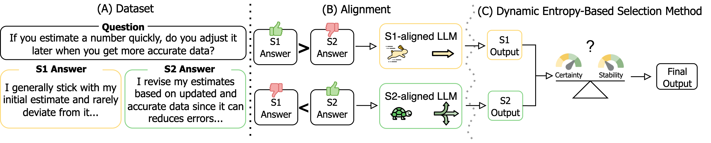
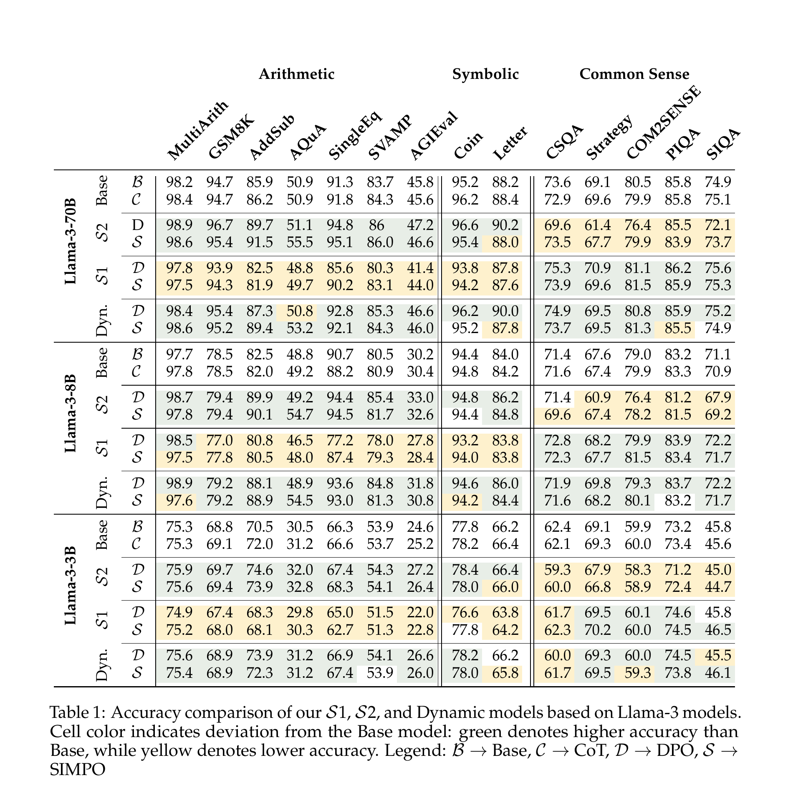

# Reasoning on a Spectrum: Aligning LLMs to System 1 and System 2 Thinking

[](https://arxiv.org/abs/2502.12470)
[](https://colm.eventhosts.cc/Conferences/2026/AcceptedPapers)
[](LICENSE)

Official code, data, raw analysis artifacts, and reproducibility instructions for the
COLM 2026 paper **“Reasoning on a Spectrum: Aligning LLMs to System 1 and System 2
Thinking.”**

<p align="center">
  
</p>

## What this repository reproduces

The artifact covers the paper's complete experimental pipeline:

1. A 2,000-question dataset with one valid System 1 and one valid System 2 answer per
   question (4,000 response rows total).
2. DPO and SimPO alignment of Llama and Mistral instruction-tuned models using LoRA.
3. Exact-match evaluation on 14 arithmetic, symbolic, and commonsense benchmarks.
4. Seven intermediate preference mixtures spanning the System 1/System 2 spectrum.
5. Token-level uncertainty, hedge-word, response-length, and decisiveness analyses.
6. Training-free dynamic arbitration using the first 32 generated tokens and the fixed
   reliability-score weight `w = 0.4`.
7. Llama 3B/8B/70B, Mistral 7B, and DeepSeek-R1-Distill-Qwen-1.5B results reported in
   the paper.

## Main findings

- System 2 alignment improves arithmetic and symbolic reasoning, where deliberate,
  multi-step computation is useful.
- System 1 alignment improves commonsense reasoning, where concise heuristic judgments
  can avoid overthinking.
- Moving from System 1 to System 2 preferences yields smooth, largely monotonic changes
  in benchmark accuracy rather than an abrupt switch.
- System 1 generations are shorter, more decisive, and lower-entropy; System 2 generations
  hedge more and exhibit different uncertainty dynamics.
- The entropy-guided dynamic model combines the strengths of both styles without additional
  training. For Llama-3-8B, DPO-dynamic improves over the base model on all 14 benchmarks;
  SimPO-dynamic improves on 12.

### Main results

Exact-match accuracy (%) across the 14 benchmarks. This is Table 1 from the paper,
including the complete Llama-3 3B, 8B, and 70B results. A machine-readable transcription
is available in [`results/paper_results.csv`](results/paper_results.csv).



## Repository layout

```text
.
├── data/system12/                 # released alignment data
├── results/paper_results.csv      # Tables 1, 8, and 9 in tidy form
├── scripts/
│   ├── prepare_benchmarks.py      # pinned third-party data preparation
│   ├── train_paper_models.sh      # System 1/System 2 endpoint training
│   ├── train_reasoning_spectrum.sh
│   ├── evaluate_paper_model.sh
│   └── evaluate_dynamic_model.sh
├── src/
│   ├── train_alignment.py         # unified DPO/SimPO LoRA trainer
│   ├── evaluate.py                # two-stage exact-match evaluation
│   ├── evaluate_dynamic.py        # entropy-guided Multi-LoRA evaluation
│   ├── system12/                  # validated data, scoring, routing utilities
│   ├── notebooks/                 # spectrum and response-length analysis
│   └── interpretability/          # raw generations, probabilities, notebooks
└── tests/                         # data, scoring, and routing regression tests
```

## 1. Environment

Create the environment:

```bash
python3.10 -m venv .venv
source .venv/bin/activate
python -m pip install --upgrade pip
python -m pip install -r requirements.txt
```

For the figure and interpretability notebooks:

```bash
python -m pip install -r requirements-analysis.txt
python -m nltk.downloader punkt punkt_tab
```

Llama checkpoints are gated. Accept Meta's model license and authenticate before running:

```bash
huggingface-cli login
```

Weights & Biases is optional. The supported trainer defaults to `--report-to none`; use
`--report-to wandb` only when experiment tracking is desired.

### Model identifiers

The checkpoint configurations in the artifact use:

| Paper scale/family | Hugging Face identifier |
|---|---|
| Llama 3B | `meta-llama/Llama-3.2-3B-Instruct` |
| Llama 8B | `meta-llama/Meta-Llama-3-8B-Instruct` |
| Llama 70B | `meta-llama/Llama-3.1-70B-Instruct` |
| Mistral 7B aligned checkpoints | `mistralai/Mistral-7B-Instruct-v0.3` |
| Reasoning-tuned robustness model | `deepseek-ai/DeepSeek-R1-Distill-Qwen-1.5B` |

See [`docs/camera_ready_checklist.md`](docs/camera_ready_checklist.md) for model/version
strings in the current PDF that should be reconciled against these saved configurations.

## 2. Data

### Alignment data

The training file is [`data/system12/cogbias.csv`](data/system12/cogbias.csv):

- 4,000 rows
- 2,000 unique questions
- exactly one System 1 and one System 2 answer per question
- columns: `Question`, `Answer`, `Strategy`

The trainer validates complete pairs before splitting. The split is prompt-disjoint and
uses 80% (1,600 questions) for training and 20% (400 questions) for validation.

### Evaluation data

Third-party benchmark data is not duplicated in git. Prepare every split from immutable
upstream revisions:

```bash
python scripts/prepare_benchmarks.py
```

If `data/benchmark` already contains an older local copy:

```bash
python scripts/prepare_benchmarks.py --force
```

The command writes `data/benchmark/MANIFEST.json` with source commits and counts. Expected evaluation sizes are:

| Category | Benchmark | Split/examples |
|---|---|---:|
| Arithmetic | MultiArith | test / 600 |
| Arithmetic | GSM8K | test / 1,319 |
| Arithmetic | AddSub | test / 395 |
| Arithmetic | AQuA-RAT | test / 254 |
| Arithmetic | SingleEq | test / 508 |
| Arithmetic | SVAMP | test / 1,000 |
| Arithmetic | AGIEval MATH | test / 1,000 |
| Symbolic | Coin Flip | generated test / 500 |
| Symbolic | Last Letter Concatenation | generated test / 500 |
| Commonsense | CommonsenseQA | dev / 1,221 |
| Commonsense | StrategyQA | released task / 2,290 |
| Commonsense | PIQA | validation / 1,838 |
| Commonsense | SocialIQA | validation / 1,954 |
| Commonsense | COM2SENSE | dev / 782 |

The first ten local-format benchmarks come from the
[Role-Play-Prompting](https://github.com/NKU-HLT/Role-Play-Prompting) release. AGIEval
MATH comes from [AGIEval](https://github.com/ruixiangcui/AGIEval), COM2SENSE from
[PlusLabNLP/Com2Sense](https://github.com/PlusLabNLP/Com2Sense), and PIQA/SocialIQA
from their pinned Hugging Face dataset revisions. Each upstream dataset remains governed
by its own license.

## 3. Train System 1 and System 2 models

The paper uses LoRA rank 8, alpha 16, dropout 0.1, five epochs, training batch size 4,
validation batch size 8, and early-stopping patience 5.

### Llama DPO defaults

- learning rate: `7e-7`
- DPO beta: `0.01`

```bash
python src/train_alignment.py \
  --algorithm dpo \
  --base-model meta-llama/Meta-Llama-3-8B-Instruct \
  --system1 \
  --output-dir experiments/camera_ready/dpo/system1

python src/train_alignment.py \
  --algorithm dpo \
  --base-model meta-llama/Meta-Llama-3-8B-Instruct \
  --system2 \
  --output-dir experiments/camera_ready/dpo/system2
```

Equivalent sequential launcher:

```bash
BASE_MODEL=meta-llama/Meta-Llama-3-8B-Instruct \
ALGORITHM=dpo \
bash scripts/train_paper_models.sh
```

### Llama SimPO defaults

- learning rate: `1e-6`
- beta: `2.5`
- gamma/beta: `0.55` (therefore gamma = `1.375`)

```bash
BASE_MODEL=meta-llama/Meta-Llama-3-8B-Instruct \
ALGORITHM=simpo \
bash scripts/train_paper_models.sh
```

### Mistral defaults

For Mistral, the trainer automatically selects the paper's family-specific settings:

- DPO: learning rate `5e-7`, beta `0.001`
- SimPO: learning rate `5e-7`, beta `2.5`, gamma/beta `0.1`

```bash
BASE_MODEL=mistralai/Mistral-7B-Instruct-v0.3 \
ALGORITHM=dpo \
bash scripts/train_paper_models.sh
```

Every output adapter includes `run_config.json` with the base model, algorithm, seed,
mixture fraction, split sizes, and resolved hyperparameters.

### Multi-GPU and 70B

Use Accelerate for multi-GPU training. Configure it once, then prepend `accelerate launch`:

```bash
accelerate config
accelerate launch src/train_alignment.py \
  --algorithm dpo \
  --base-model meta-llama/Llama-3.1-70B-Instruct \
  --system2 \
  --output-dir experiments/camera_ready/llama70b/dpo/system2
```

Global effective batch size is
`number_of_GPUs × train_batch_size × gradient_accumulation_steps`. If hardware forces a
smaller per-device batch, increase `--gradient-accumulation-steps` to preserve it.

## 4. Evaluate one model

Evaluation follows the paper's two-stage protocol:

1. Generate free-form reasoning from the benchmark question.
2. Provide the question and first-stage response again with the benchmark-specific final
   answer instruction from Appendix N.
3. Normalize the final output and compute exact match.

Smoke-test ten examples:

```bash
python src/evaluate.py \
  --model experiments/camera_ready/dpo/system1 \
  --dataset commonsensqa \
  --limit 10
```

Run all 14 benchmarks:

```bash
MODEL=experiments/camera_ready/dpo/system1 \
BATCH_SIZE=8 \
bash scripts/evaluate_paper_model.sh
```

Base and zero-shot-CoT baselines use the same evaluator:

```bash
MODEL=meta-llama/Meta-Llama-3-8B-Instruct \
PROMPT_MODE=zero-shot \
bash scripts/evaluate_paper_model.sh

MODEL=meta-llama/Meta-Llama-3-8B-Instruct \
PROMPT_MODE=cot \
bash scripts/evaluate_paper_model.sh
```

Each run writes:

```text
experiments/evaluation/<model>/<prompt-mode>/<benchmark>/
├── predictions.csv   # prompt, reasoning, final output, normalized answer, correctness
└── metrics.json      # exact-match aggregate and complete run identity
```

For an exact rerun, do not change prompt mode, benchmark split, model revision, seed,
generation limits, or answer normalization. Generation is greedy (`do_sample=False`).

## 5. Reproduce the reasoning spectrum

The seven intermediate models prefer System 1 for 12.5%, 25%, 37.5%, 50%, 62.5%,
75%, and 87.5% of prompts. Assignment is seeded and performed at the paired-question
level, so `chosen` and `rejected` responses always refer to the same prompt and no missing
pairs are possible.

```bash
BASE_MODEL=meta-llama/Meta-Llama-3-8B-Instruct \
ALGORITHM=dpo \
bash scripts/train_reasoning_spectrum.sh
```

Evaluate each adapter using Section 4, aggregate the resulting `metrics.json` files, and use
[`src/notebooks/plot_ratio.ipynb`](src/notebooks/plot_ratio.ipynb) to recreate the spectrum
plots (Figures 4 and 7).

## 6. Reproduce the dynamic model

For a question `x`, the dynamic model generates the first `n = 32` tokens with both
adapters. For token `i` it computes

```text
H_i = -sum_v p(v | t_<i, x) log p(v | t_<i, x)
```

It then computes prefix mean entropy and population variance for System 1 and System 2,
normalizes each statistic by the sum across systems, and scores each system as

```text
R_i = 0.4 * normalized_mean_entropy_i
    + 0.6 * normalized_entropy_variance_i
```

The lower-scoring adapter continues generation from its already-generated prefix. This
uses one shared base model with two LoRA adapters and adds only the unselected 32-token
prefix relative to a single-model response. There is no extra router training.

Smoke test:

```bash
python src/evaluate_dynamic.py \
  --system1-adapter experiments/camera_ready/dpo/system1 \
  --system2-adapter experiments/camera_ready/dpo/system2 \
  --dataset gsm8k \
  --prefix-tokens 32 \
  --mean-weight 0.4 \
  --limit 10
```

Complete evaluation:

```bash
SYSTEM1_ADAPTER=experiments/camera_ready/dpo/system1 \
SYSTEM2_ADAPTER=experiments/camera_ready/dpo/system2 \
bash scripts/evaluate_dynamic_model.sh
```

The dynamic output records both models' entropy means, entropy variances, reliability
scores, selected adapter, final response, and exact-match result for every example.

Hyperparameters `n = 32` and `w = 0.4` were selected on a randomly sampled 10% AGIEval
validation subset and then fixed for all reported experiments. The supported implementation
uses natural-log entropy, exact score comparison, and deterministic System 1 tie-breaking;
it does not add the undocumented random 1% tie margin found in an exploratory script.

## 7. Response and interpretability analyses

The repository includes the raw generations/probabilities and notebooks used for the
paper's behavioral analyses:

| Paper analysis | Reproduction artifact |
|---|---|
| Response-length change across stages (Figure 2) | `src/notebooks/response_analysis.ipynb` and `src/notebooks/data/` |
| Token-level uncertainty (Figure 3A) | `src/interpretability/check_probabilities.ipynb` and `probabilities/` |
| Hedge-word ratio (Figure 3B) | `src/interpretability/analysis_on_results_aggv2.ipynb`, `hedges.txt`, `weasels.txt` |
| Definitive answers (Figure 3C / Figure 8) | `check_sys1_2_answers_generations*.ipynb` and annotation CSVs |
| Spectrum interpolation (Figures 4 and 7) | `src/notebooks/plot_ratio.ipynb` |
| Entropy routing validation (Figures 5, 11, and 12) | dynamic per-example scores plus the probability JSON artifacts |
| Token counts / response-length table | `calculate_avg_tokens.py`, `src/count_tokens.py`, and `results/token_count_summary.csv` |

Raw CSV and JSON artifacts are intentionally retained even though they make the repository
larger: they allow the statistical and plotting analyses to be checked without spending the
full model-inference budget again.

The LLM-as-judge definitiveness analysis in Appendix S used Phi-4 (14B), 200 randomly
sampled items from each benchmark, the first `n ∈ {1, 3, 6, 9, 12, 15}` sentences, and six
solved demonstrations. The exact prompt is reproduced in the paper; cached annotation
outputs are under `src/interpretability/`.

<!--
## 8. Validation and expected checks

Run the lightweight regression suite before launching GPUs:

```bash
pytest -q
python -m compileall -q src scripts
```

The checks verify:

- exactly 2,000 complete alignment pairs;
- an 80/20 prompt-disjoint split;
- exact preference proportions without the missing-value bug in the original ratio code;
- all 14 benchmark registrations and expected sizes when third-party data is present;
- benchmark-specific answer normalization;
- Equation (3), zero-denominator behavior, and deterministic tie handling;
- complete machine-readable result coverage.

Reproduced accuracies can still differ slightly across GPU architecture, CUDA kernels,
driver versions, and model-host revisions. Preserve each adapter's `run_config.json` and
each evaluation's `metrics.json`, and record the exact model commit when strict bit-level
traceability is required.

## Experiment-to-paper map

| Paper component | Train command | Evaluation/analysis |
|---|---|---|
| Tables 1 and 8: S1/S2/base/CoT/dynamic | `train_paper_models.sh` | `evaluate_paper_model.sh`, `evaluate_dynamic_model.sh` |
| Table 9: reasoning-tuned model | `train_alignment.py --base-model deepseek-ai/DeepSeek-R1-Distill-Qwen-1.5B` | same evaluators |
| Figure 2: response length | endpoint models | `response_analysis.ipynb` |
| Figure 3: uncertainty/hedging/decisiveness | endpoint models | interpretability notebooks and cached outputs |
| Figures 4 and 7: spectrum | `train_reasoning_spectrum.sh` | evaluate each ratio; `plot_ratio.ipynb` |
| Figures 5, 11, and 12: router validation | no additional training | dynamic metrics, `w`/`n` sweeps |
| Appendix K: unnormalized-length ablation | train with the archived unnormalized dataset variant | same two-stage evaluator |
| Appendix L: voice-normalization ablation | train with the corresponding archived normalized variant | same two-stage evaluator |
-->
<!--
## Citation

```bibtex
@inproceedings{ziabari2026reasoning,
  title     = {Reasoning on a Spectrum: Aligning {LLM}s to System 1 and System 2 Thinking},
  author    = {Ziabari, Alireza S. and Ghazizadeh, Nona and Sourati, Zhivar and
               Karimi-Malekabadi, Farzan and Piray, Payam and Dehghani, Morteza},
  booktitle = {Conference on Language Modeling (COLM)},
  year      = {2026}
}
```

Preprint: [arXiv:2502.12470](https://arxiv.org/abs/2502.12470) ·
[COLM 2026 accepted-paper list](https://colm.eventhosts.cc/Conferences/2026/AcceptedPapers)
-->
## License

Code and original repository materials are released under the
[Apache License 2.0](LICENSE). Third-party datasets and model checkpoints retain their
respective licenses and terms of use.
